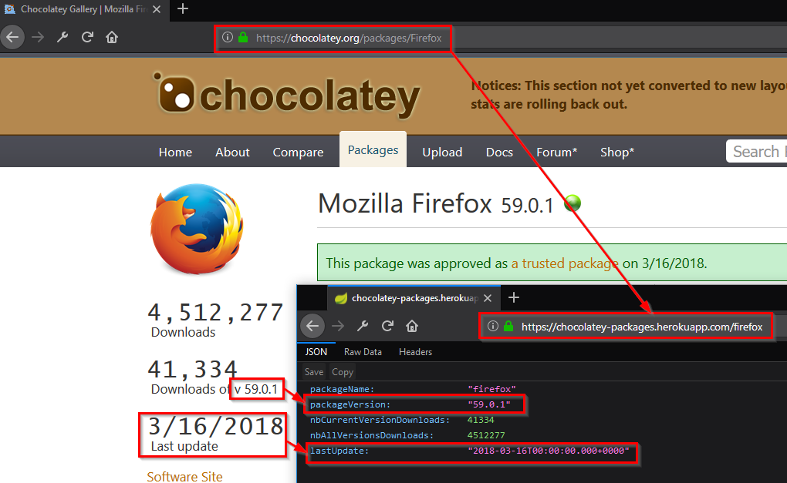

[](https://travis-ci.org/adriens/chocolatey-api)

# chocolatey-api
API to get chocolatey packages details in REST/json.

# API

Just :

Get all metadats about a package (Chocolatey Webpage AND
[`nuspec`](https://github.com/chocolatey/choco/wiki/CreatePackages#nuspec))

```
/{package}
/packages/{package}
/packages/{package}/nuspec
```

To only get the `nuspec` datas from a given version (not the latest) :

```
/packages/{package}/nuspec
/packages/{package}/latest/nuspec
/packages/{package}/{version}/nuspec
```

# Demo



